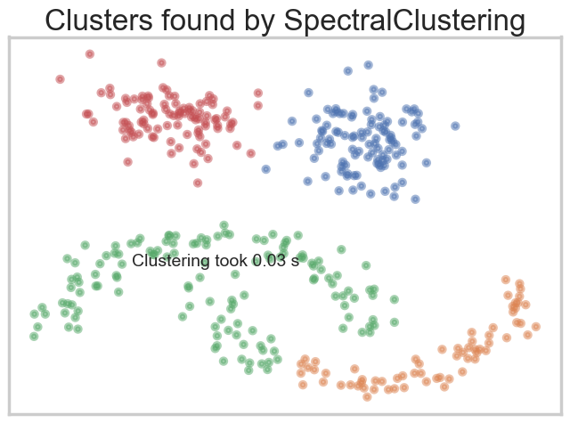
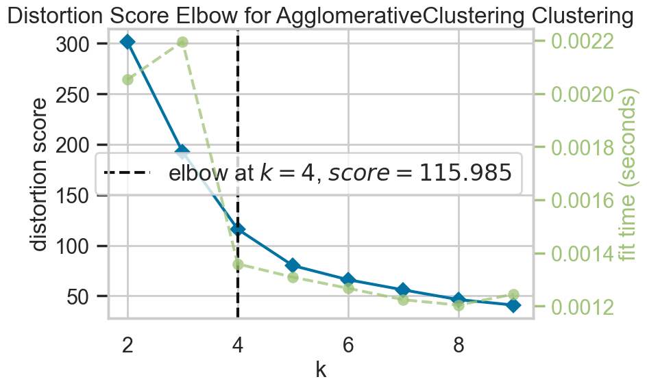
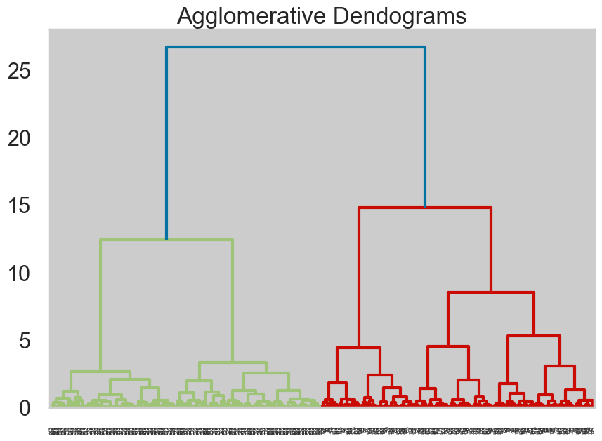
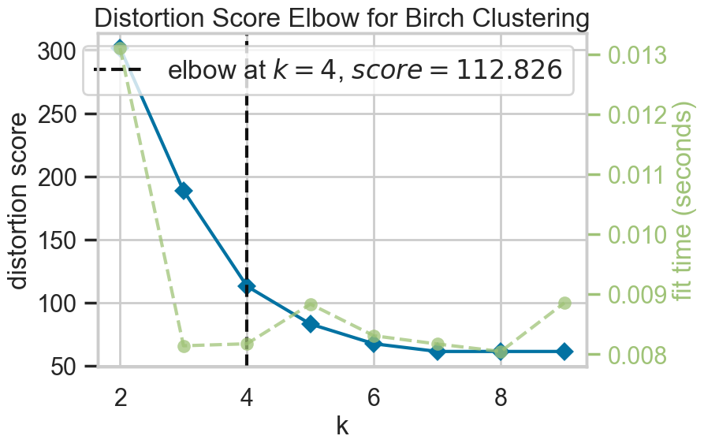

# Clustering Algorithms

There are a lot of clustering algorithms to choose from. The standard sklearn clustering suite has thirteen different clustering classes alone. So, what clustering algorithms should you be using? As with every question in data science and machine learning, it depends on your data. A number of those thirteen classes in sklearn are specialised for certain tasks. Obviously, an algorithm specialising in text clustering is going to be the right choice for clustering text data. Thus, if you know enough about your data, you can narrow down on the clustering algorithm that best suits that kind of data or the sorts of important properties your data has. But what if you don’t know much about your data? If, for example, you are ‘just looking’ and doing some exploratory data analysis (EDA), it is not so easy to choose a specialised algorithm.

